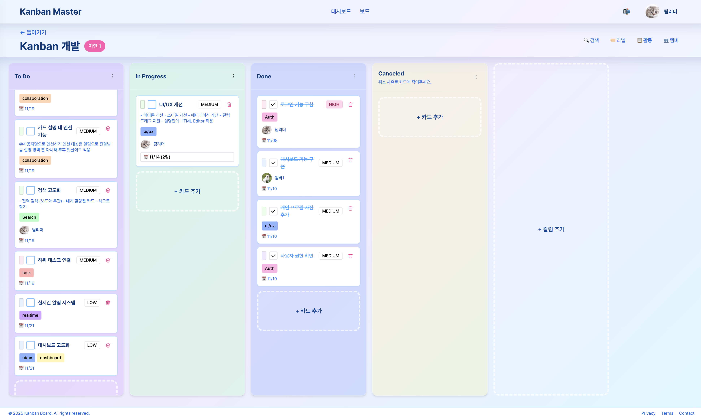

# Kanban Master

Spring Boot와 React로 구축한 아름다운 글래스모피즘 디자인의 모던 칸반 보드 애플리케이션입니다.



## ✨ 주요 기능

-   🎨 **아름다운 글래스모피즘 UI** - 쿨한 파스텔 톤 색상과 유리 효과
-   📋 **모던 칸반 보드** - 보드, 컬럼, 카드로 작업 관리
-   🔐 **사용자 인증** - JWT 기반 회원가입/로그인, 토큰 갱신
-   👥 **보드 멤버 관리** - 멤버 초대, 역할 기반 권한 관리 (OWNER, ADMIN, MEMBER, VIEWER)
-   🏷️ **라벨 시스템** - 카드에 라벨 추가/관리, 색상 및 순서 지정
-   🔍 **고급 검색** - 제목, 설명, 라벨, 담당자 기반 카드 검색
-   📝 **보드 템플릿** - 보드를 템플릿으로 저장하고 재사용
-   📊 **활동 로그** - 보드 및 카드의 모든 변경 사항 추적
-   🏢 **워크스페이스** - 사용자별 워크스페이스 관리
-   ⚡ **빠르고 반응적** - React 19와 Spring Boot 3로 구축
-   🔄 **실시간 업데이트** - Backend REST API 연동
-   📱 **반응형 디자인** - 모든 디바이스에서 동작

## 🛠 기술 스택

### Backend

-   **Java 17** - 최신 Java LTS 버전
-   **Spring Boot 3.2.0** - 엔터프라이즈급 프레임워크
-   **Gradle (Kotlin DSL)** - 빌드 자동화 도구
-   **H2 Database** - 개발용 인메모리 데이터베이스
-   **Spring Data JPA** - 데이터 영속성 관리
-   **Lombok** - 보일러플레이트 코드 감소

### Frontend

-   **React 19** - 최신 React와 모던 Hooks
-   **TypeScript** - 타입 안정성
-   **Vite** - 초고속 빌드 도구
-   **Tailwind CSS** - 유틸리티 우선 CSS 프레임워크
-   **Axios** - HTTP 클라이언트
-   **커스텀 디자인 시스템** - 글래스모피즘 + 파스텔 컬러

## 📁 프로젝트 구조

```
kanban-master/
├── backend/                      # Spring Boot REST API
│   ├── src/main/java/com/kanban/
│   │   ├── activity/            # 활동 로그 (Activity, ActivityController, ActivityService, Repository)
│   │   ├── auth/                # 인증/인가 (AuthController, AuthService, JWT, Security Config)
│   │   │   ├── config/          # JWT 설정
│   │   │   ├── dto/             # 인증 관련 DTO
│   │   │   ├── security/        # Security Filter, Entry Point
│   │   │   └── token/           # JWT Token Provider
│   │   ├── board/               # 보드 관리 (Board, BoardController, BoardService, Repository)
│   │   │   ├── dto/             # 보드 DTO
│   │   │   └── member/          # 보드 멤버 및 초대 관리
│   │   ├── card/                # 카드 관리 (Card, CardController, CardService, Repository)
│   │   ├── column/              # 컬럼 관리 (BoardColumn, ColumnController, ColumnService, Repository)
│   │   ├── label/               # 라벨 관리 (Label, CardLabel, Controller, Service, Repository)
│   │   ├── search/              # 검색 기능 (SearchController, SearchService)
│   │   ├── template/            # 보드 템플릿 (BoardTemplate, TemplateController, TemplateService)
│   │   ├── user/                # 사용자 관리 (User, UserController, UserRepository)
│   │   ├── workspace/           # 워크스페이스 관리 (Workspace, WorkspaceMember, Repository)
│   │   ├── common/              # 공통 유틸리티 (SecurityUtil)
│   │   ├── config/              # 설정 (JPA, Web, RestClient, OpenAPI, Async, Jackson)
│   │   ├── controller/          # 공통 컨트롤러 (HealthController)
│   │   ├── entity/              # 공통 엔티티 (BaseEntity)
│   │   └── exception/           # 예외 처리 (GlobalExceptionHandler, Custom Exceptions)
│   ├── src/main/resources/
│   │   └── application.yml      # 애플리케이션 설정
│   ├── build.gradle.kts         # Gradle 빌드 스크립트
│   └── CLAUDE.md                # Backend 코딩 표준
│
├── frontend/                     # React SPA
│   ├── src/
│   │   ├── api/                 # API 레이어 (빈 디렉토리)
│   │   ├── components/          # React 컴포넌트
│   │   │   ├── board/           # 보드 관련 컴포넌트
│   │   │   └── label/           # 라벨 관련 컴포넌트
│   │   ├── context/             # React Context (AuthContext, BoardContext, CardContext, ColumnContext)
│   │   ├── hooks/               # 커스텀 React Hooks (useBoards, usePermissions, useModalAnimation 등)
│   │   ├── pages/               # 페이지 컴포넌트 (LoginPage, SignupPage, BoardsPage, DashboardPage, BoardDetailPage)
│   │   │   ├── BoardDetailPage/ # 보드 상세 페이지 및 하위 컴포넌트
│   │   │   └── DashboardPage/   # 대시보드 페이지 및 하위 컴포넌트
│   │   ├── services/            # API 서비스 레이어 (authService, boardService, cardService 등)
│   │   ├── styles/              # 스타일 유틸리티 (modalStyles)
│   │   ├── types/               # TypeScript 타입 정의 (board, card, column, label, user 등)
│   │   ├── utils/               # 유틸리티 함수 (axios, authStorage)
│   │   ├── App.tsx              # 메인 애플리케이션 컴포넌트
│   │   ├── main.tsx             # 진입점
│   │   └── index.css            # 글로벌 스타일 + 글래스모피즘
│   ├── tailwind.config.js       # Tailwind + 디자인 시스템 설정
│   ├── vite.config.ts           # Vite 설정
│   ├── CLAUDE.md                # Frontend 코딩 표준
│   ├── DESIGN.md                # 디자인 시스템 문서
│   └── API_INTEGRATION.md       # API 연동 가이드
│
├── package.json                  # Monorepo 스크립트
├── CLAUDE.md                     # Monorepo 전체 표준
├── INTEGRATION_TEST.md           # 통합 테스트 가이드
└── README.md                     # 이 파일
```

## 🚀 시작하기

### 필수 요구사항

다음 프로그램들이 설치되어 있어야 합니다:

-   **Java 17** 이상
-   **Node.js 18+** 및 **npm 9+**
-   **Git** (버전 관리용)

버전 확인:

```bash
java -version   # 17 이상이어야 함
node -version   # 18 이상이어야 함
npm -version    # 9 이상이어야 함
```

### 1️⃣ 저장소 클론

```bash
git clone <repository-url>
cd kanban-master
```

### 2️⃣ 의존성 설치

#### 방법 A: 한 번에 설치 (권장)

```bash
# 루트 의존성 설치 (concurrently)
npm install

# 프론트엔드 의존성 설치
npm run install:frontend
```

#### 방법 B: 개별 설치

```bash
# 루트 의존성
npm install

# 프론트엔드
cd frontend
npm install
cd ..

# 백엔드 의존성은 Gradle이 자동으로 관리합니다
```

### 3️⃣ 애플리케이션 실행

#### 빠른 시작 (백엔드 + 프론트엔드 동시 실행)

```bash
npm run dev
```

백엔드와 프론트엔드를 동시에 실행합니다:

-   Backend: http://localhost:8080
-   Frontend: http://localhost:3000

#### 개별 실행

```bash
# 터미널 1 - Backend
npm run dev:backend
# 또는
cd backend && ./gradlew bootRun

# 터미널 2 - Frontend
npm run dev:frontend
# 또는
cd frontend && npm run dev
```

### 4️⃣ 설치 확인

브라우저를 열고 다음 주소로 이동:

-   **프론트엔드**: http://localhost:3000
-   글래스모피즘 디자인의 칸반 보드가 보여야 합니다
-   하단 상태바에 "✅ kanban-backend" 및 상태 "UP"이 표시되어야 합니다

### 5️⃣ 개발 도구 접속 (선택사항)

#### H2 콘솔 (데이터베이스 확인)

-   **URL**: http://localhost:8080/h2-console
-   **JDBC URL**: `jdbc:h2:file:./data/kanban`
-   **사용자명**: `sa`
-   **비밀번호**: (비워두기)

#### Swagger UI (API 문서 및 테스트)

-   **URL**: http://localhost:8080/swagger-ui/index.html
-   REST API 엔드포인트 확인 및 직접 테스트 가능

### 6️⃣ API 엔드포인트 개요

백엔드는 다음과 같은 REST API를 제공합니다:

-   **`/api/v1/auth`** - 인증 (회원가입, 로그인, 토큰 갱신, 프로필 조회)
-   **`/api/v1/boards`** - 보드 관리 (CRUD, 멤버 관리, 초대)
-   **`/api/v1/columns`** - 컬럼 관리 (생성, 수정, 삭제, 순서 변경)
-   **`/api/v1/cards`** - 카드 관리 (CRUD, 이동, 순서 변경)
-   **`/api/v1/labels`** - 라벨 관리 (CRUD, 순서 변경)
-   **`/api/v1/card-labels`** - 카드-라벨 연결 관리
-   **`/api/v1/search`** - 카드 검색
-   **`/api/v1/templates`** - 보드 템플릿 관리
-   **`/api/v1/activities`** - 활동 로그 조회
-   **`/api/v1/users`** - 사용자 검색
-   **`/api/v1/health`** - 헬스 체크

자세한 API 명세는 Swagger UI에서 확인하세요.

## 🎨 Vibe Coding 가이드

이 프로젝트는 **Vibe Coding**을 위해 설계되었습니다 - 명확한 문서와 디자인 시스템을 활용한 AI 보조 개발 방식입니다.

### 디자인 시스템

우리의 디자인 시스템은 **글래스모피즘**과 **쿨한 파스텔 컬러**를 사용합니다. 모든 디자인 토큰과 컴포넌트는 다음 문서에 정리되어 있습니다:

📖 **`frontend/DESIGN.md`** - 완전한 디자인 시스템 문서

-   색상 팔레트 (5가지 파스텔 컬러 × 10단계)
-   글래스모피즘 유틸리티 (`.glass`, `.glass-light`, `.glass-heavy`)
-   타이포그래피, 간격, 그림자
-   컴포넌트 예제
-   접근성 가이드라인

#### 색상 빠른 참조

```javascript
// Tailwind에서 사용 가능한 파스텔 컬러
pastel-blue-{50-900}    // 주요 색상
pastel-purple-{50-900}  // 보조 색상
pastel-cyan-{50-900}    // 강조 색상
pastel-mint-{50-900}    // 성공 색상
pastel-pink-{50-900}    // 경고 색상
```

#### 글래스 효과 빠른 적용

```jsx
<div className="glass rounded-2xl p-6 shadow-glass">
  {/* 글래스 카드 */}
</div>

<button className="glass glass-hover px-4 py-2 rounded-xl">
  {/* 호버 효과가 있는 글래스 버튼 */}
</button>
```

### 코딩 표준

Monorepo의 각 부분마다 고유한 코딩 표준이 있습니다:

#### 📘 루트 - `./CLAUDE.md`

-   Monorepo 관리
-   프론트엔드/백엔드 간 통신 표준
-   Git 워크플로우
-   개발 워크플로우
-   보안 가이드라인

#### 📗 백엔드 - `./backend/CLAUDE.md`

-   Java 17/Spring Boot 3.2 모범 사례
-   도메인 중심 패키지 구조 (각 도메인별 entity, controller, service, repository, dto)
-   Modern Java 기능 활용 (records, var, streams, Optional, pattern matching)
-   네이밍 규칙 및 레이어별 책임
-   에러 처리 및 예외 전략
-   트랜잭션 관리 및 페이지네이션
-   테스트 표준 (Unit, Integration, Repository Tests)
-   SOLID 원칙 및 보안 가이드

#### 📙 프론트엔드 - `./frontend/CLAUDE.md`

-   React 19/TypeScript 5.3+ 모범 사례
-   컴포넌트 구조 (함수형 컴포넌트 + Hooks)
-   프로젝트 구조 (components, pages, hooks, contexts, services, types, utils)
-   커스텀 훅 패턴 및 Context API
-   API 호출을 위한 서비스 레이어
-   Tailwind CSS 스타일링 가이드
-   에러 처리 및 타입 안정성
-   디자인 시스템 참조 (DESIGN.md)

### API 연동 가이드

📖 **`frontend/API_INTEGRATION.md`** - 완전한 API 연동 가이드

-   Axios 설정
-   서비스 레이어 예제
-   API 호출을 위한 커스텀 훅
-   에러 처리 패턴
-   인증 설정

API 사용 예제:

```typescript
import { boardService } from '@/services/boardService';
import { authService } from '@/services/authService';

// 사용자 인증
const { accessToken, user } = await authService.login({
    email: 'user@example.com',
    password: 'password',
});

// 모든 보드 가져오기
const boards = await boardService.getAll();

// 보드 생성
const newBoard = await boardService.create({
    name: '내 보드',
    description: '보드 설명',
});

// 카드 검색
import { searchService } from '@/services/searchService';
const results = await searchService.searchCards(boardId, {
    keyword: '검색어',
    labelIds: [1, 2],
});
```

### 개발 워크플로우

1. **디자인 시스템 확인** - UI 컴포넌트는 `frontend/DESIGN.md` 참조
2. **코딩 표준 준수** - 해당하는 `CLAUDE.md` 파일 참조
3. **경로 별칭 사용** - 프론트엔드에서 `@/` 접두사로 import
4. **모든 것에 타입 지정** - 모든 데이터에 TypeScript 타입 사용
5. **API 연동 테스트** - `API_INTEGRATION.md` 패턴 따르기
6. **일관성 유지** - 코드베이스의 기존 패턴 사용

### 새 기능 만들기

#### 백엔드 API

```bash
# 1. backend/src/main/java/com/kanban/{domain}/에 도메인별 패키지 생성
#    예: activity/, auth/, board/, card/, column/, label/, search/, template/, user/, workspace/
# 2. 도메인 엔티티 생성 (Entity 클래스)
# 3. 리포지토리 인터페이스 생성 (Repository)
# 4. DTO 클래스 생성 (dto/ 하위 패키지)
# 5. 비즈니스 로직을 가진 서비스 생성 (Service)
# 6. REST 엔드포인트를 가진 컨트롤러 생성 (Controller)
# 7. H2 콘솔이나 curl, Swagger UI로 테스트
```

#### 프론트엔드 컴포넌트

```bash
# 1. frontend/src/types/에 TypeScript 타입 정의
# 2. frontend/src/services/에 API 서비스 생성
# 3. frontend/src/context/에 Context API 생성 (상태 관리가 필요한 경우)
# 4. frontend/src/hooks/에 커스텀 훅 생성 (선택사항)
# 5. frontend/src/components/ 또는 frontend/src/pages/에 컴포넌트 생성
#    - 공통 컴포넌트: components/
#    - 페이지 컴포넌트: pages/
#    - 페이지별 하위 컴포넌트: pages/{PageName}/components/
# 6. DESIGN.md의 디자인 시스템 스타일 적용
# 7. 브라우저에서 테스트
```

## 🔧 사용 가능한 스크립트

### 루트 레벨

```bash
npm run dev                # 백엔드 & 프론트엔드 동시 실행 (hot reload 포함)
npm run dev:backend        # 백엔드만 실행
npm run dev:backend:watch  # 백엔드 hot reload (자동 재컴파일)
npm run dev:frontend       # 프론트엔드만 실행
npm run build              # 두 프로젝트 모두 빌드
npm run build:backend      # 백엔드만 빌드
npm run build:frontend     # 프론트엔드만 빌드
npm run install:frontend   # 프론트엔드 의존성 설치
npm run install:backend    # 백엔드 의존성 갱신
npm run clean              # 모든 빌드 결과물 삭제
```

### 백엔드 (backend/ 디렉토리에서)

```bash
./gradlew bootRun        # Spring Boot 앱 실행
./gradlew build          # JAR 파일 빌드
./gradlew clean          # 빌드 결과물 삭제
./gradlew test           # 테스트 실행
```

### 프론트엔드 (frontend/ 디렉토리에서)

```bash
npm run dev              # Vite 개발 서버 시작
npm run build            # 프로덕션용 빌드
npm run preview          # 프로덕션 빌드 미리보기
npm run lint             # ESLint 실행
```

## 🧪 테스트

### 백엔드 테스트

```bash
cd backend
./gradlew test
```

### 프론트엔드 테스트

```bash
cd frontend
npm test
```

### 통합 테스트

완전한 통합 테스트 가이드는 `INTEGRATION_TEST.md`를 참조하세요.

## 📚 문서

-   **`README.md`** (이 파일) - 프로젝트 개요 및 설정
-   **`CLAUDE.md`** - Monorepo 전체 개발 표준
-   **`backend/CLAUDE.md`** - 백엔드 코딩 표준
-   **`frontend/CLAUDE.md`** - 프론트엔드 코딩 표준
-   **`frontend/DESIGN.md`** - 디자인 시스템 문서
-   **`frontend/API_INTEGRATION.md`** - API 연동 가이드
-   **`INTEGRATION_TEST.md`** - 통합 테스트 가이드

## 🐛 문제 해결

### 백엔드 이슈

```bash
# 포트 8080이 사용 중일 때
lsof -ti:8080 | xargs kill -9

# 클린 후 재빌드
cd backend
./gradlew clean build
```

### 프론트엔드 이슈

```bash
# 포트 3000이 사용 중일 때
lsof -ti:3000 | xargs kill -9

# node_modules 삭제 후 재설치
cd frontend
rm -rf node_modules
npm install
```

### 백엔드에 연결할 수 없을 때

1. 백엔드가 실행 중인지 확인: `npm run dev:backend`
2. 백엔드 로그에서 에러 확인
3. 백엔드가 포트 8080에서 실행 중인지 확인: `curl http://localhost:8080/api/v1/health`
4. `vite.config.ts`의 프론트엔드 프록시 설정 확인

## 🚢 배포

### 백엔드

```bash
cd backend
./gradlew build
java -jar build/libs/kanban-backend-0.0.1-SNAPSHOT.jar
```

### 프론트엔드

```bash
cd frontend
npm run build
# dist/ 폴더를 호스팅 서비스에 배포
```

## 🤝 기여하기

1. `CLAUDE.md` 파일들의 코딩 표준을 따르세요
2. `DESIGN.md`의 디자인 시스템을 사용하세요
3. 새 기능에 대한 테스트를 작성하세요
4. 필요에 따라 문서를 업데이트하세요
5. 의미 있는 커밋 메시지를 작성하세요

## 📄 라이선스

[라이선스를 여기에 작성하세요]

## 🎯 구현 현황 및 다음 단계

### ✅ 완료된 기능

-   [x] 보드 관리 구현 (CRUD)
-   [x] 컬럼 관리 추가
-   [x] 카드 관리 추가
-   [x] 사용자 인증 (JWT 기반)
-   [x] 보드 멤버 관리 및 권한 제어 (RBAC)
-   [x] 라벨 시스템
-   [x] 고급 검색 기능
-   [x] 보드 템플릿
-   [x] 활동 로그
-   [x] 워크스페이스 관리

### 🚧 진행 중 및 계획

-   [ ] 드래그 앤 드롭으로 카드 이동
-   [ ] 실시간 협업 (WebSocket)
-   [ ] 카드 코멘트 및 첨부파일
-   [ ] 알림 시스템
-   [ ] 프로덕션용 PostgreSQL
-   [ ] Docker 배포
-   [ ] CI/CD 파이프라인
-   [ ] E2E 테스트 자동화

---

**즐거운 Vibe Coding 되세요! 🎨✨**
